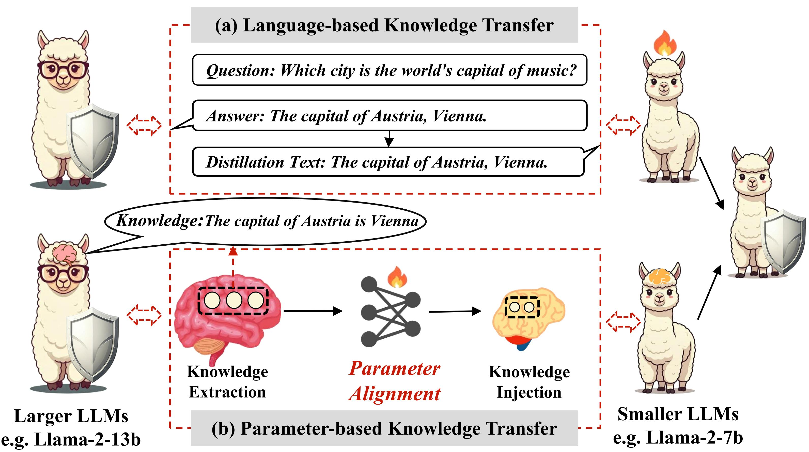
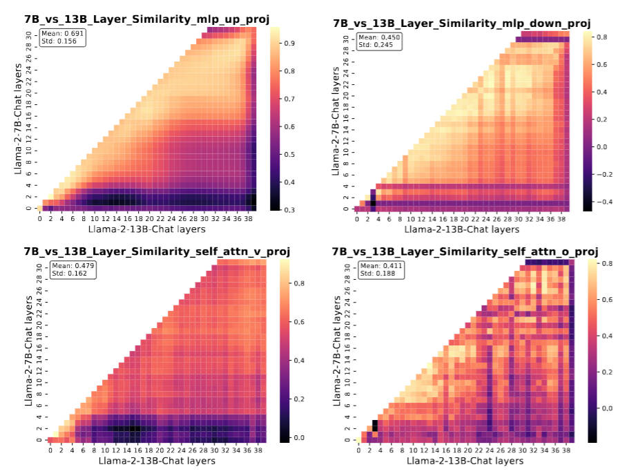
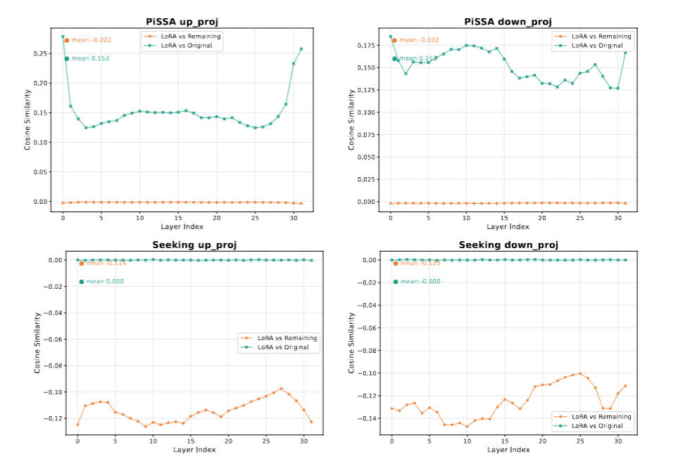

# Neural Incompatibility: The Unbridgeable Gap of Cross-Scale Parametric Knowledge Transfer in Large Language Models

This repository is built for the paper "Neural Incompatibility: The Unbridgeable Gap of Cross-Scale Parametric Knowledge Transfer in Large Language Models".

## Overview

In this work, we investigate the infeasibility of cross-scale Parametric Knowledge Transfer (PKT) in Large Language Models (LLMs). Through in-depth analysis, we identify **Neural Incompatibility** as the ethological and parametric structural differences between LLMs of varying scales, presenting fundamental challenges to achieving effective PKT.

1. We are the first to comprehensively define and explore parametric knowledge transfer between cross-scale LLMs. The meticulous categorization of PKT is seperate into Post-Align PKT and Pre-Align PKT based on the **Alignment** time.
2. We propose a novel method **Locate-Then-Align (LaTen)** to first try to solve **Pre-Align challenge** (also first proposed in our paper), which leverages neuron attribution and hypernetwork techniques to execute alignment with minimal training data achieves promissing performance.
  

The comparison between LaTen and language-based transfer methods is shown as follows,

  
 

By conducting extensive experiments, we find that: 
1. Comprehensive quantitative and qualitative assessments have highlighted the **Neural Incompatibility** which are similar to the cross-species neural mechanism as a key challenge arising from low-similarity of both ethological and parametric structural in cross-scale LLMs. 

  

    
  

  

    
  

## Language Models and Datasets 
We conduct experiments on decoder-based LLM: Llama-2-7b-chat-hf and Llama-2-13b-chat-hf.
* We evaluate three tasks on four datasets: MMLU (Professional Knowledge), GSM8K (mathematical reasoning), and HumanEval and MBPP (code-generating).
Note that we provide our split MMLU, GSM8K, MATH, and MBPP datasets in `data/` folder.
## Acknowledgments

We are grateful to the authors of [ParaKnowTransfer](https://github.com/maszhongming/ParaKnowTransfer/), [Knowledge Neurons](https://github.com/EleutherAI/knowledge-neurons), [neuron-attribution](https://github.com/zepingyu0512/neuron-attribution) and [open-instruct](https://github.com/allenai/open-instruct) for making their project codes publicly available. We build our project based on these great works.

